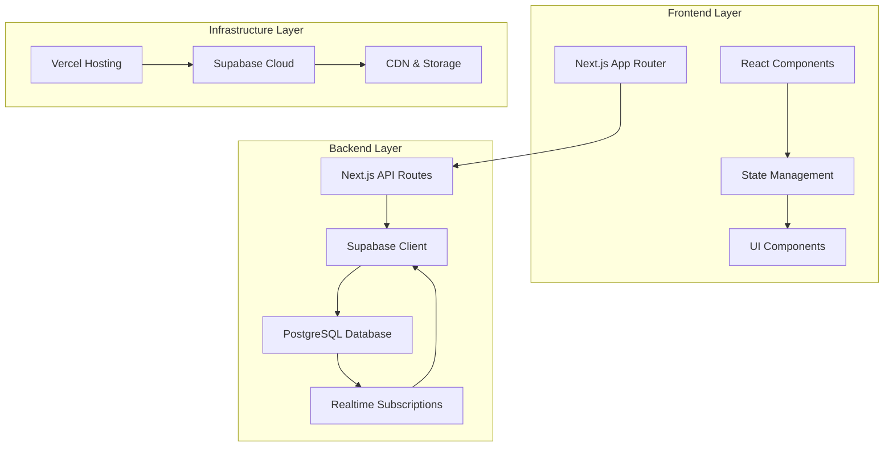
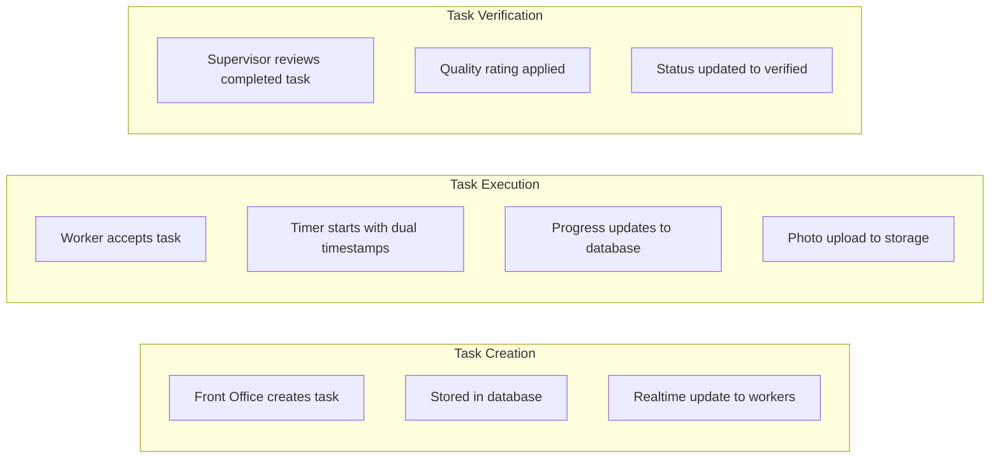

# System Patterns: Hermes Resort Task Management System

## System Architecture

### High-Level Architecture

### Component Architecture

#### Frontend Components
- **Pages**: Role-based routing (`/worker`, `/supervisor`, `/front-office`, `/admin`)
- **Layout**: Root layout with authentication provider and error boundaries
- **Components**: Modular component library with feature-specific organization
- **Hooks**: Custom React hooks for task management and state
- **Utils**: Shared utility functions for date handling, validation, and formatting

#### Backend Structure
- **API Routes**: RESTful endpoints with middleware authentication
- **Database**: Supabase PostgreSQL with RLS policies
- **Realtime**: WebSocket connections for live updates
- **Storage**: Supabase Storage with bucket policies

## Key Technical Decisions

### State Management Pattern
- **Context API**: React Context for global authentication state
- **Local State**: useState for component-specific state
- **Server State**: Supabase queries for data consistency
- **Realtime Updates**: Supabase subscriptions for live synchronization

### Authentication Pattern
- **JWT Tokens**: Stateless authentication with refresh mechanism
- **Session Management**: Secure HTTP-only cookies with expiration
- **Role-Based Access**: Middleware protection for route-level security
- **Row Level Security**: Database policies for data access control

### Data Flow Pattern

### Design Patterns in Use

#### Component Patterns
- **Compound Components**: Higher-order components for cross-cutting concerns
- **Render Props**: Flexible component interfaces with composition
- **Custom Hooks**: Reusable state logic extraction
- **Error Boundaries**: Graceful error handling with fallbacks

#### Data Patterns
- **Repository Pattern**: Supabase client abstraction for database operations
- **Observer Pattern**: Realtime subscriptions for reactive updates
- **Command Pattern**: Task state mutations with audit logging
- **Query Pattern**: Optimized data fetching with caching

#### UI Patterns
- **Mobile-First**: Responsive design with touch interactions
- **Progressive Enhancement**: PWA capabilities with offline support
- **Loading States**: Skeleton screens and optimistic updates
- **Form Validation**: Zod schemas with real-time feedback

## Component Relationships

### Core Data Models
- **Task**: Central entity with status lifecycle and audit trail
- **User**: Authentication entity with role-based permissions
- **Shift**: Scheduling entity with dual-shift support
- **Photo**: Media entity with categorized storage
- **Audit**: History entity for compliance tracking

### Service Dependencies
- **Task Service**: Business logic for task operations
- **Auth Service**: Authentication and session management
- **Notification Service**: Real-time alert system
- **Storage Service**: Photo upload and management
- **Analytics Service**: Performance tracking and reporting

## Critical Implementation Paths

### Task Lifecycle
1. **Creation**: Front office → Database → Worker notification
2. **Assignment**: System auto-assignment based on availability and skills
3. **Execution**: Worker timer with pause/resume and photo documentation
4. **Verification**: Supervisor review with quality rating and approval
5. **Completion**: Archive task with audit trail retention

### Authentication Flow
1. **Login**: Username/password validation with JWT generation
2. **Session**: Secure cookie with role-based access
3. **Authorization**: Middleware validation for protected routes
4. **Refresh**: Automatic token renewal with session extension

### Real-time Data Flow
1. **Task Updates**: Supabase realtime for status changes
2. **Notifications**: Push notifications for task assignments
3. **Presence Tracking**: Worker availability and status updates
4. **Sync Conflicts**: Offline mode with queue management

## Security Architecture

### Authentication Layers
- **Transport**: HTTPS with secure cookie flags
- **Session**: JWT with expiration and refresh tokens
- **Authorization**: Role-based access control with route protection
- **Data Access**: Row Level Security policies in database

### Data Protection
- **Input Validation**: Zod schemas for all user inputs
- **SQL Injection**: Parameterized queries with Supabase client
- **XSS Protection**: React's built-in sanitization with CSP headers
- **Photo Security**: Bucket policies with user-specific access

## Performance Patterns

### Database Optimization
- **Indexing Strategy**: Task assignment and status queries optimized
- **Connection Pooling**: Supabase client with connection reuse
- **Query Optimization**: Selective column fetching with pagination
- **Caching Strategy**: React Query for client-side data caching

### Frontend Optimization
- **Code Splitting**: Route-based chunk loading
- **Image Optimization**: Supabase storage with CDN delivery
- **Bundle Analysis**: Size monitoring with lazy loading
- **PWA Caching**: Service worker for offline functionality

## Integration Patterns

### External Systems
- **Property Management**: Planned integration with resort management systems
- **Payment Processing**: Future integration with billing systems
- **Reporting**: Analytics integration with business intelligence
- **Communication**: Email/SMS integration for guest notifications

### API Design
- **RESTful Endpoints**: Standard HTTP methods with status codes
- **Version Management**: API versioning with backward compatibility
- **Rate Limiting**: Request throttling for system protection
- **Documentation**: OpenAPI specification with interactive docs